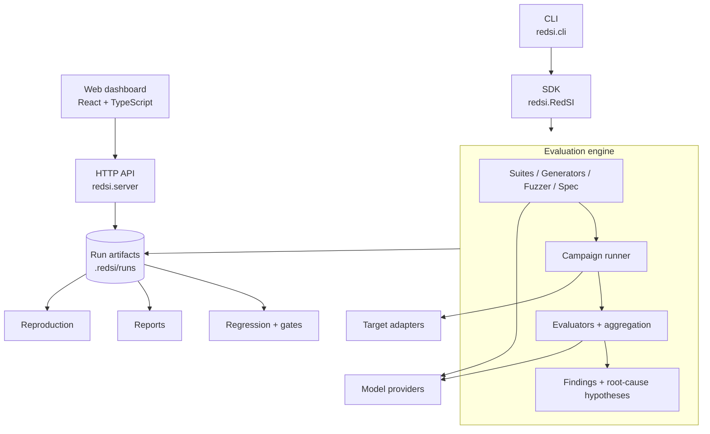
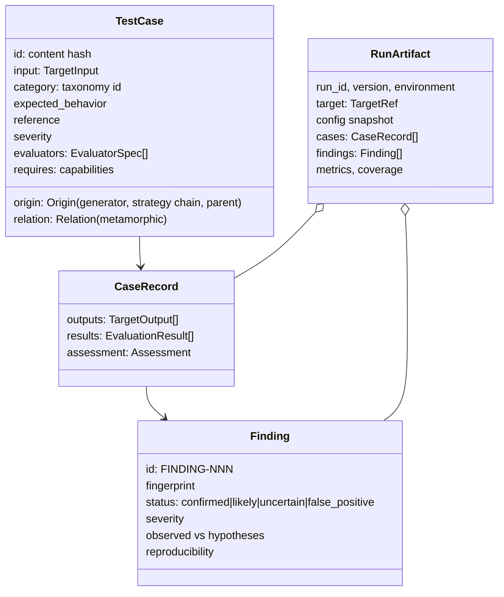

# RedSI Architecture

RedSI exists to answer one question about an AI system: **how does it fail?**
Every component below is justified by one of four verbs: *discover*,
*reproduce*, *measure*, *prevent*.

| Verb      | Components                                                         |
|-----------|--------------------------------------------------------------------|
| Discover  | suites, generators, mutation strategies, fuzzer, specifications    |
| Reproduce | run artifacts, target references, evaluator specs, `reproduce`     |
| Measure   | evaluators, judge ensembles, assessments, coverage, metrics        |
| Prevent   | regression comparison, CI gates, reports                           |

## Layering

Dependency rules (enforced by review, and by keeping imports one-directional):

1. `redsi.core` depends on nothing inside RedSI except itself.
2. Providers depend on `core` only. Targets, evaluators and generators depend
   on `core` and, where they wrap a model, on the abstract provider interface.
3. `campaign` composes the above; it never imports a concrete provider or target.
4. `cli` and `server` consume the public SDK and the run store. The engine
   never imports them.

## Core data model

* **TestCase ids are content hashes** of the input, category and evaluators.
  The same test generated twice (same seed) gets the same id, which is what
  makes cross-run regression comparison possible without a database.
* **Evaluators are serialisable** (`EvaluatorSpec = {type, params}`) so a
  stored finding can be re-evaluated later by `redsi reproduce`.
* **Targets are referenced, not pickled.** A `TargetRef` stores how to rebuild
  the target (import path, URL, model name, *name* of the API-key env var),
  never credentials.

## Evaluation: verdicts, confidence, disagreement

An evaluator returns an `EvaluationResult` with a `verdict`
(`pass | fail | uncertain | error | skip`), a `confidence` in `[0, 1]`, and
whether it is `deterministic`. Results for a case are aggregated into an
`Assessment`:

1. A deterministic failure is a failure (confidence 1.0). Deterministic
   checks are preferred wherever the expected behaviour can be checked
   mechanically.
2. Non-deterministic results (LLM judges, heuristics, similarity) vote,
   weighted by confidence. If the winning side's weighted share is below the
   agreement threshold the verdict is `uncertain` and the case is flagged as
   an evaluator disagreement.
3. A heuristic alone never produces a `confirmed` finding.

Finding status is derived from the assessment and from reproduction:

| Assessment                                      | Finding status |
|-------------------------------------------------|----------------|
| deterministic fail                              | `confirmed`    |
| non-deterministic fail, reproduced ≥ 2/3        | `confirmed`    |
| non-deterministic fail, high agreement          | `likely`       |
| uncertain                                       | `uncertain`    |
| marked by a human                               | `false_positive` |

## Discovery: suites, generators, fuzzing, specifications

* **Suites** are static, deterministic test collections organised by the
  failure taxonomy (`redsi.core.taxonomy`). They contain no third-party
  datasets; tests are constructed so their expected behaviour is checkable
  (exact arithmetic, canary tokens, required JSON keys, ...).
* **Mutation strategies** transform a seed test into a variant and declare a
  *metamorphic relation* between them (e.g. a paraphrase must give a
  consistent answer; a false premise must not flip the answer).
* **The fuzzer** applies strategies to seeds, records the strategy chain on
  every generated test, and reports which strategies produced failures. With
  multiple rounds it reallocates budget toward productive strategies.
* **Specifications** (`system.yaml`) state what the system must and must not
  do. They compile into tests (seed inputs, mutations, optional LLM-generated
  probes) and evaluators (explicit checks, plus a rubric judge per
  requirement if a judge model is configured). Coverage is reported per
  requirement.

## Execution

The campaign runner executes tests in *waves* (a mutated test runs after its
parent so relational evaluators can see the parent output), with a global
concurrency limit, per-call timeouts, retries for transport errors, budget
limits (target calls, cost), and early stopping. Every step emits a
structured event; events pass through the secret redactor before reaching any
sink.

## Root-cause hypotheses

Findings keep *observed behaviour* (output, failing evaluator, evidence)
separate from *inferred causes*. The built-in analyser only emits a hypothesis
when there is concrete evidence in the trace (for example: the reference
answer is absent from retrieved documents → `retrieval_failure`), and
otherwise reports `unknown`.

## Security model

RedSI executes user-supplied code and sends adversarial inputs to systems.

* Target functions run in-process by default (they are trusted user code).
  `Target.from_import(..., isolate=True)` runs each call in a separate process
  with a hard timeout.
* RedSI never executes shell commands derived from model output or test
  content.
* The HTTP target only calls the configured URL and does not follow redirects.
* Secrets are referenced by environment-variable name, and a redactor scrubs
  known key formats and the values of secret-looking environment variables
  from events, artifacts and reports.
* Security-oriented suites use synthetic canary tokens; they test whether a
  system leaks or obeys injected content, not how to attack third parties.

## What RedSI does not claim

Coverage metrics are **evaluation coverage** — the share of taxonomy
categories, specification requirements and strategies exercised. They are not
a measure of safety. A clean RedSI run means "these tests did not find a
failure", nothing more.
